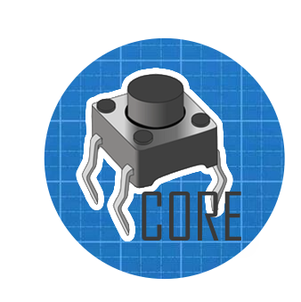

### [EN](README.en.md) [RU](README.md)

# microbutton-core



## Описание
Проект выступает в роле ядра, описывая общие принципы и интерфейсы для работы с физическим представлением кнопки.

Является зависимостью таких реализаций как [microbutton-pin](https://github.com/SuperPracion/microbutton-pin) или [microbutton-spi](https://github.com/SuperPracion/microbutton-spi), реализующих работу с кнопкой подключенной к Pin или к шине SPI.

## Установка

Используйте пакетный менеджер [pip](https://pip.pypa.io/en/stable/) для установки microbutton-core.

```bash
pip install https://github.com/SuperPracion/microbutton-core.git
```
После установки библиотеки файла microbutton-core необходимо разместить в папку .\lib для использования на микроконтроллере.

```bash
python install.py
```

## Использование

#### Button

### Атрибут класса хранящей текущее значение состояния кнопки.
state
```python
...
if button.state == ...:
# or
if button.state in [...]:
# or
switch button.state:
    case ...
# or
print(button.state)
```

#### press_value
```python
```

#### unpress_value
```python
```

#### .is_press возвращающая True в случае если кнопка Нажата
```python
if button.is_press:
    print("button is press!")
```

#### .is_unpress возвращающая True в случае если кнопка Отжата.
```python
if button.is_unpress:
    print("button is unpress")
```

#### .is_long_press возвращающая True в случае если кнопка находится в состоянии Долгого удержания.
```python
```

#### .is_click возвращающая True в случае если кнопкой был сделал Клик.
```python
```

#### .is_double_click возвращающая True в случае если кнопкой был сделал Двойной Клик.
```python
```

#### .is_multi_click возвращающая True в случае если кнопкой был сделал Мульти Клик.
```python
```

#### tick()
```python
```

#### PRESS = 0
```python
```

#### UNPRESS = 1
```python
```

#### LONG_PRESS = 2
```python
```

#### MIN_PRESS_TIME_OVER = 400  # ms
```python
```

## Алгоритм


## Лицензия

[Apache](http://www.apache.org/licenses/)