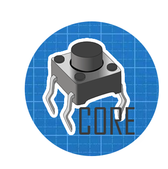
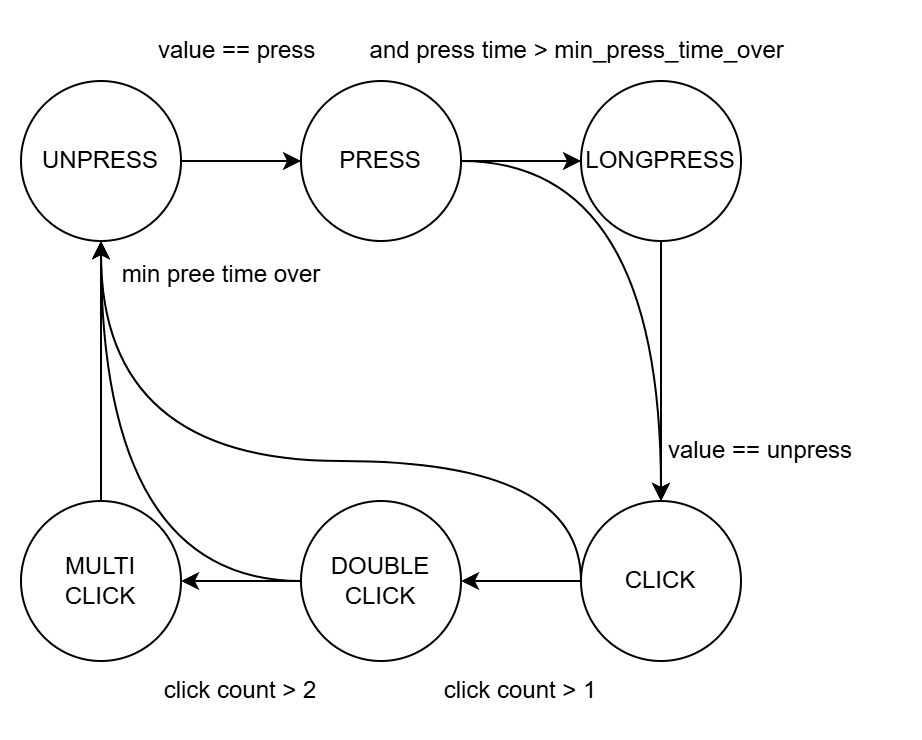

### [EN](README.md) [RU](README.ru.md)

# microbutton-core



## Description
This project acts as a core library. It explains basic principles and interfaces for working with physical buttons.

It's used by other libraries like [microbutton-pin](https://github.com/SuperPracion/microbutton-pin) or [microbutton-spi](https://github.com/SuperPracion/microbutton-spi). These handle buttons connected to Pins or SPI buses.

## How It Works


## Installation
Use the [mip](https://docs.micropython.org/en/latest/reference/packages.html) package manager to install:

```python
import mip
mip.install("github:SuperPracion/microbutton-core/microbutton_core/button.py")
```

For a specific version:
```python
import mip
mip.install("github:SuperPracion/microbutton-core/microbutton_core/button.py", version="branch-or-tag")
```

## How To Use
```python
from lib.button import Button, PRESS, UNPRESS

# Default PullUp Button
button = Button()

# PullDown Button (reversed states)
button = Button(
    press_value=UNPRESS,
    unpress_value=PRESS,
)
# or 
button = Button(
    press_value=1,
    unpress_value=0,
)
# For special state values
button = Button(
    press_value=3,
    unpress_value=0,
)
```

### Class Attributes
#### state
```python
if button.state == ...:
# or
if button.state in [...]:
# or
switch button.state:
    case ...
# or
print(button.state)
```

#### .is_press Check if press
```python
if button.is_press:
    print("Button pressed!")
```

#### .is_unpress Check if unpress
```python
if button.is_unpress:
    print("Button released")
```
#### .is_long_press Check if released
Check long press
```python
if button.is_long_press:
    print("Long press")
```

#### .is_click Check single click
```python
if button.is_click:
    print("Single click")
```

#### .is_double_click Check double click
```python
if button.is_double_click:
    print("Double click")
```

#### .is_multi_click Check multiple clicks
```python
if button.is_multi_click:
    print("Multiple clicks")
```

#### tick()
```python
class MicroButton(Button):
    def __init__(self, data_source):
        super().__init__()
        self.data_source = data_source

    def tick(self):
        self.value = data_source.value()  # Get new value

mbt = MicroButton()
mbt.tick()  # Call regularly
```

### Default Values
```python
PRESS = 0           # Button pressed value
UNPRESS = 1         # Button released value
LONG_PRESS = 2      # Long press state
MIN_PRESS_TIME_OVER = 400  # Min press time (ms)
```

## License
[Apache](http://www.apache.org/licenses/)