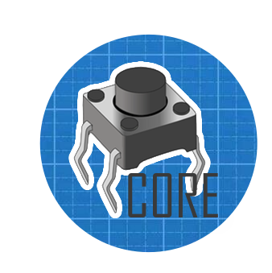

### [EN](README.md) [RU](README.ru.md)

# microbutton-core



## Описание
Проект выступает в роле ядра, описывая общие принципы и интерфейсы для работы с физическим представлением кнопки.

Является зависимостью таких реализаций как [microbutton-pin](https://github.com/SuperPracion/microbutton-pin) или [microbutton-spi](https://github.com/SuperPracion/microbutton-spi), реализующих работу с кнопкой подключенной к Pin или к шине SPI.

## Алгоритм


## Установка

Используйте пакетный менеджер [mip](https://docs.micropython.org/en/latest/reference/packages.html) для установки microbutton-core как библиотеки:

```python
import mip
mip.install("github:SuperPracion/microbutton_core/button.py")
```
Если нужна определённая версия:
```python
import mip
mip.install("github:SuperPracion/microbutton_core/button.py", version="branch-or-tag")
```

## Использование

#### Button
```python
from lib.button import Button, PRESS, UNPRESS

# Default PullUp Button
button = Button()

# PullDown Button (reversed states)
button = Button(
    press_value=UNPRESS,
    unpress_value=PRESS,
)
# or 
button = Button(
    press_value=1,
    unpress_value=0,
)
# For special state values
button = Button(
    press_value=3,
    unpress_value=0,
)
```

### Атрибут класса хранящей текущее значение состояния кнопки.
#### state
```python
if button.state == ...:
# or
if button.state in [...]:
# or
switch button.state:
    case ...
# or
print(button.state)
```

#### press_value
```python
print(button.press_value)
# quick/hot update, not recommended
button.press_value = ...
```

#### unpress_value
```python
print(button.unpress_value)
# quick/hot update, not recommended
button.unpress_value = ...
```

#### .is_press возвращающая True в случае если кнопка Нажата
```python
if button.is_press:
    print("button is press!")
```

#### .is_unpress возвращающая True в случае если кнопка Отжата.
```python
if button.is_unpress:
    print("button is unpress")
```

#### .is_long_press возвращающая True в случае если кнопка находится в состоянии Долгого удержания.
```python
if button.is_long_press:
    print("button is long press")
```

#### .is_click возвращающая True в случае если кнопкой был сделал Клик.
```python
if button.is_click:
    print("button is click")
```

#### .is_double_click возвращающая True в случае если кнопкой был сделал Двойной Клик.
```python
if button.is_double_click:
    print("button is double click")
```

#### .is_multi_click возвращающая True в случае если кнопкой был сделал Мульти Клик.
```python
if button.is_multi_click:
    print("button is multi click")
```

#### tick()
```python
from lib.button import Button


class MicroButton(Button):
    def __init__(self, source_data_class):
        super().__init__()
        self.source_data_class = source_data_class

    def tick(self):
        self.value = source_data_class.value()

mbt = MicroButton()
mbt.tick()
```

#### PRESS = 0
```python
# Стандартное значение используемое для описания состояния нажатия кнопки
from lib.button import PRESS
```

#### UNPRESS = 1
```python
# Стандартное значение используемое для описания состояния нажатия отжатия
from lib.button import UNPRESS
```

#### LONG_PRESS = 2
```python
# Стандартное значение используемое для описания состояния долгого нажатия
from lib.button import LONG_PRESS
```

#### MIN_PRESS_TIME_OVER = 400  # ms
```python
# Стандартное значение используемое для описания минимального времени сброса состояния нажатия 
from lib.button import MIN_PRESS_TIME_OVER
```

## Лицензия

[Apache](http://www.apache.org/licenses/)